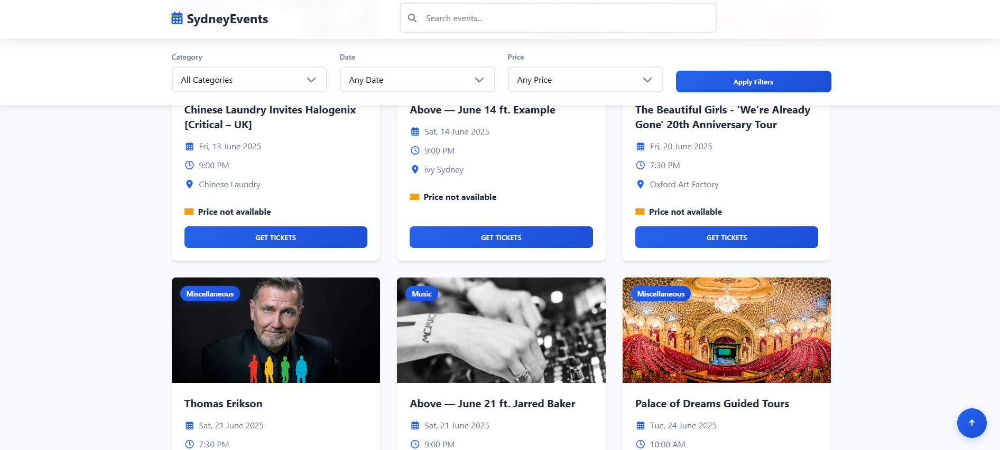
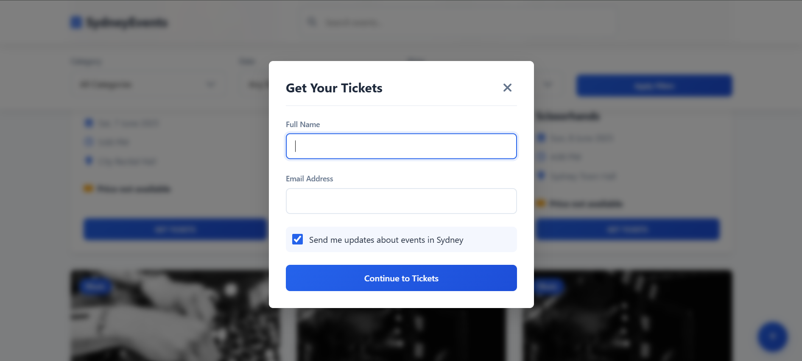
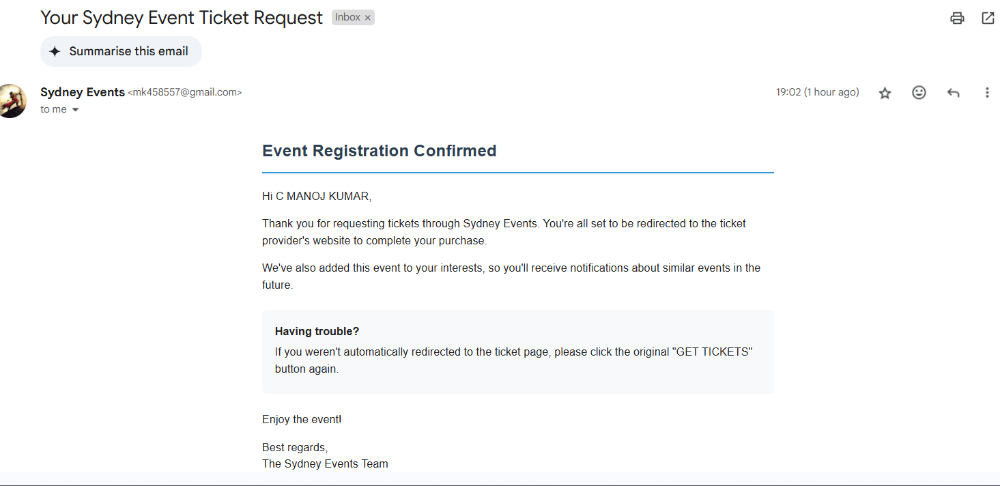

# Sydney Events

A modern web application for discovering and exploring events happening in Sydney. Built with a focus on user experience and beautiful design, this platform helps users find concerts, festivals, exhibitions, and more happening around the city.






## Features

- 🔍 **Smart Search**: Find events by keywords, categories, or dates
- 📅 **Date Filtering**: Filter events by today, tomorrow, weekend, week, or month
- 💰 **Price Filtering**: Find free or paid events
- 🎫 **Ticket Booking**: Easy ticket booking system with email notifications
- 📱 **Responsive Design**: Works seamlessly on desktop and mobile devices
- ⚡ **Modern UI**: Beautiful animations and transitions
- 🔔 **Real-time Updates**: Stay informed about new events
- 📧 **Email Subscriptions**: Get updates about events in Sydney

## Tech Stack

- HTML5
- CSS3 (with modern features like CSS Grid and Flexbox)
- JavaScript (ES6+)
- Font Awesome Icons
- Animate.css for animations

## Getting Started

### Prerequisites

- A modern web browser (Chrome, Firefox, Safari, Edge)
- Node.js (if running locally)

### Installation

1. Clone the repository:
```bash
git clone https://github.com/yourusername/sydney-events.git
```

2. Navigate to the project directory:
```bash
cd sydney-events
```

3. Open `index.html` in your browser or set up a local server:
```bash
# Using Python
python -m http.server 8000

# Using Node.js
npx serve
```

4. Visit `http://localhost:8000` in your browser

## API Integration

The application integrates with the Ticketmaster API to fetch event data. To set up the API:

1. Get your API key from [Ticketmaster Developer Portal](https://developer-acct.ticketmaster.com/user/login)
2. Configure the API key in your environment variables
3. Update the API endpoints in the application

## Contributing

Contributions are welcome! Please feel free to submit a Pull Request. For major changes, please open an issue first to discuss what you would like to change.

1. Fork the repository
2. Create your feature branch (`git checkout -b feature/AmazingFeature`)
3. Commit your changes (`git commit -m 'Add some AmazingFeature'`)
4. Push to the branch (`git push origin feature/AmazingFeature`)
5. Open a Pull Request

## License

This project is licensed under the MIT License - see the [LICENSE](LICENSE) file for details.

## Acknowledgments

- [Ticketmaster API](https://developer.ticketmaster.com/products-and-docs/apis/getting-started/) for event data
- [Font Awesome](https://fontawesome.com/) for icons
- [Animate.css](https://animate.style/) for animations
- [Unsplash](https://unsplash.com/) for images

## Contact


Project Link: [https://github.com/kingslayer458/sydney-events](https://github.com/yourusername/sydney-events) 
